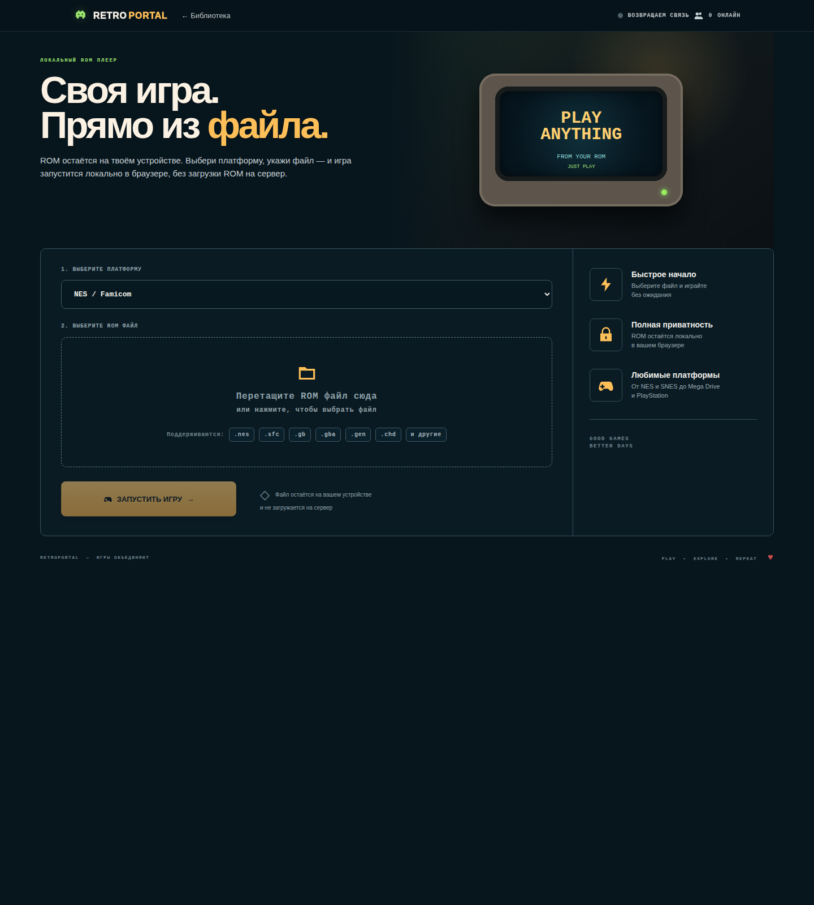

# Retro Portal

<p align="center"><strong>Ламповая self-hosted библиотека ретро-игр: владелец собирает коллекцию, игроки просто нажимают «Играть».</strong></p>

<p align="center">
  <a href="https://indie-master.github.io/retro-portal/"><strong>🎮 ОТКРЫТЬ LIVE DEMO</strong></a>
  &nbsp;·&nbsp; <a href="README_EN.md">English</a>
  &nbsp;·&nbsp; <a href="docs/ru/INSTALL.md">Установка</a>
  &nbsp;·&nbsp; <a href="docs/ru/LIBRARY.md">Library Manager</a>
  &nbsp;·&nbsp; <a href="docs/ru/NGINX.md">Nginx / TLS</a>
</p>

<p align="center">
  
  
  
  
  
</p>


### Локальный ROM-плеер



## Как это работает

Retro Portal разделяет **игровой интерфейс** и **управление коллекцией**.

```text
Игрок
  ↓
/                     → только готовые к запуску игры
/game.html?id=...      → запуск в браузере
/local.html            → свой локальный ROM, без загрузки на сервер

Владелец сервера
  ↓
/admin.html             → ROM, BIOS, сканирование и метаданные
```

На публичной странице нет `НЕТ ROM`, `НУЖЕН BIOS`, путей к файлам или других администраторских деталей. Если игра ещё не подготовлена владельцем сервера, посетитель её просто не видит.

Эмуляция выполняется на устройстве игрока, поэтому серверу не требуется GPU. Сервер хранит сайт, ROM/BIOS, каталог, artwork и EmulatorJS, а также обслуживает API и online-presence.

## Library Manager

После установки откройте:

```text
https://ваш-домен/admin.html
```

Если `ADMIN_TOKEN` не был указан в `.env`, backend создаст случайный токен при первом запуске:

```bash
cat catalog/admin-token
```

Дальше есть два нормальных сценария.

### 1. Загрузить ROM через браузер

В Library Manager выберите файл и платформу. Для `.nes`, `.gba`, `.md` и других однозначных форматов система определяется автоматически. Для `.chd`, `.bin`, `.cue` и других неоднозначных форматов нужно указать консоль.

После загрузки Retro Portal:

- сохраняет ROM в нужную папку;
- автоматически создаёт или обновляет карточку;
- пытается сопоставить игру с локальным curated preset;
- при настроенном TheGamesDB автоматически пробует получить название, год, описание, число игроков и box-art;
- проверяет обязательный BIOS;
- показывает владельцу точный недостающий файл;
- публикует игру на главной **только когда она реально готова к запуску**.

Если внешний metadata-provider ничего не нашёл, импорт ROM всё равно считается успешным: остаётся локальная preset/fallback-карточка, а поиск метаданных можно повторить позже.

### 2. Скопировать большую библиотеку через SCP/SFTP

```text
games/roms/megadrive/
games/roms/ps1/
games/roms/dreamcast/
games/roms/nes/
games/roms/snes/
...
```

После копирования нажмите **Сканировать** в `/admin.html`. Новые файлы будут автоматически зарегистрированы без ручного редактирования JSON.

Подробно: **[docs/ru/LIBRARY.md](docs/ru/LIBRARY.md)**.

## BIOS

BIOS — забота владельца сервера, а не игрока. Library Manager показывает его только в административной панели.

Для известных PS1 BIOS менеджер умеет распознавать файл по MD5 и сохранять под каноническим именем. Например, карточка может ожидать:

```text
games/bios/ps1/scph5501.bin
```

Dreamcast-профиль сейчас ожидает:

```text
games/bios/dreamcast/dc_boot.bin
games/bios/dreamcast/dc_flash.bin
```

Сам Dreamcast runtime пока отмечен как experimental.

## Автоматические карточки и обложки

Без внешних сервисов портал уже умеет:

- узнать подготовленные игры из `catalog/presets/curated-classics.json`;
- создать карточку неизвестной игры из имени ROM;
- определить платформу по однозначному расширению;
- автоматически скрывать неготовые игры от посетителей.

Опционально можно подключить **TheGamesDB** для автоматического поиска названия, года, описания, количества игроков и box-art. API key остаётся только на backend:

```ini
THEGAMESDB_API_KEY=ваш-api-key
```

После этого при обычной загрузке ROM через Library Manager enrichment запускается автоматически. Ручная кнопка **Обновить метаданные** остаётся для повторного поиска.

## Возможности

- тёплый CRT-интерфейс с лёгкими 8-bit деталями;
- библиотека по платформам и поиск;
- публично отображаются только playable-игры;
- owner-only Library Manager;
- автоматическая регистрация ROM после upload или сканирования папок;
- автоматическое metadata/box-art enrichment при подключённом provider;
- диагностика обязательного BIOS;
- curated presets для популярных Mega Drive / PS1 / Dreamcast игр;
- локальный ROM Player — пользовательский файл не отправляется на сервер;
- self-hosted EmulatorJS `4.2.3` в обычной установке;
- fullscreen и Browser Gamepad API;
- browser-side сохранения / save states;
- online/playing presence;
- Docker Compose;
- безопасная интеграция в обычный Nginx или `stream :443 + ssl_preread`;
- wildcard/SAN certificate reuse, Let's Encrypt HTTP-01 и Cloudflare DNS-01;
- обязательный `nginx -t` перед reload;
- GitHub Pages demo.

## Live Demo

**https://indie-master.github.io/retro-portal/**

GitHub Pages показывает только те demo/homebrew игры, которые действительно можно запустить. Коммерческие ROM, BIOS и официальные artwork в публичный demo и репозиторий не входят.

## Требования

| Ресурс | Минимум | Рекомендуется |
|---|---:|---:|
| Ubuntu | 22.04 | 24.04 LTS |
| CPU | 1 vCPU | 2 vCPU |
| RAM | 1 GB | 2 GB |
| Диск | 20 GB | 40+ GB NVMe |
| Сеть | 100 Mbps | 1 Gbps |
| GPU | не нужен | не нужен |

## Быстрый старт

```bash
sudo apt update
sudo apt install -y git
git clone https://github.com/indie-master/retro-portal.git
cd retro-portal
sudo ./scripts/install.sh
```

Установщик предложит:

```text
1) Полная автоматическая установка
2) Интеграция в существующий Nginx
3) Ручная интеграция — приложение + готовые snippets
4) Локальный тест без домена и TLS
```

Подробно: [docs/ru/INSTALL.md](docs/ru/INSTALL.md).

## Быстрый тест с открытыми demo-ROM

```bash
./scripts/install-emulatorjs.sh 4.2.3
./scripts/install-homebrew-roms.sh
docker compose up -d --build
```

В demo доступны шесть MIT-лицензированных Mega Drive homebrew-игр: Tank Battle, Battle 4Tris, Pong, Snake Arena, Space Shooter и Breakout.

## Подготовленные presets

В проекте уже есть metadata presets для:

**Mega Drive:** Sonic the Hedgehog 2 · Mortal Kombat II · Streets of Rage 2 · Comix Zone · Road Rash III · Contra: Hard Corps

**PlayStation:** Tekken 3 · Crash Bandicoot 3: Warped · Crash Team Racing · Tony Hawk's Pro Skater 2 · Resident Evil 2 · Worms Armageddon

**Dreamcast — experimental:** Crazy Taxi · Soulcalibur · Sonic Adventure · Jet Set Radio

Это **метаданные**, а не ROM. Если владелец загружает соответствующий образ, Library Manager может использовать preset для корректной карточки.

## Nginx и TLS

Установщик сначала анализирует `nginx -T`, а не переписывает живую конфигурацию вслепую.

```text
Обычная схема:
Internet :443 → Nginx HTTPS → 127.0.0.1:8088 → Retro Portal

Сложная схема:
Internet :443 → Nginx stream + ssl_preread → inner HTTPS → Retro Portal
```

Перед reload всегда выполняется `nginx -t`. Если автоматическая интеграция небезопасна, installer создаёт готовый snippet. Подробнее: [docs/ru/NGINX.md](docs/ru/NGINX.md).

## Полезные команды

```bash
cat catalog/admin-token
./scripts/doctor.sh --domain arcade.example.com
sudo ./scripts/nginx-detect.sh arcade.example.com
python3 ./scripts/catalog-check.py
./scripts/backup.sh
docker compose logs -f --tail=100
```

## Dreamcast

Каталог и multi-file BIOS checks готовы, но Flycast WASM пока считается experimental и не публикуется как production-ready runtime. См. [docs/ru/DREAMCAST.md](docs/ru/DREAMCAST.md).

## Правовой момент

Retro Portal — программная оболочка. Репозиторий не распространяет коммерческие ROM, BIOS или официальные artwork. Владелец сервера самостоятельно отвечает за право использования добавленного контента.

## Лицензия

Код Retro Portal распространяется по MIT. Лицензии сторонних компонентов перечислены в [THIRD_PARTY.md](THIRD_PARTY.md).
