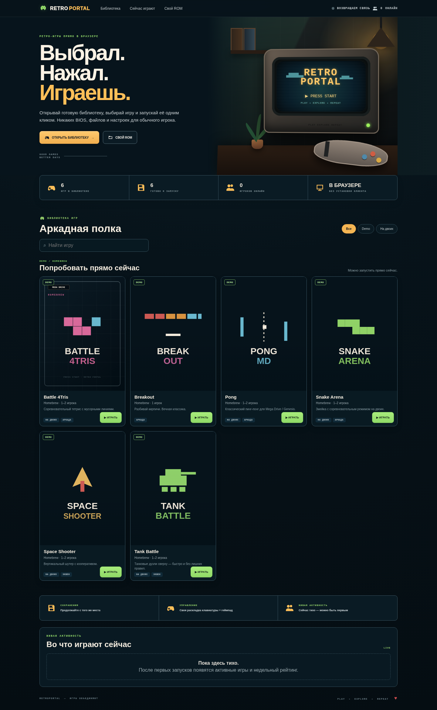
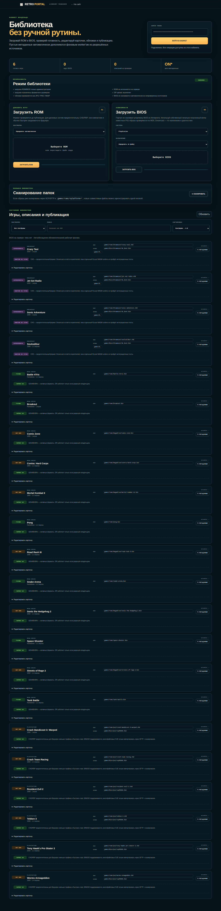

# Retro Portal

<p align="center"><strong>A self-hosted retro game library that runs directly in the browser.</strong></p>

<p align="center">
  <a href="https://indie-master.github.io/retro-portal/"><strong>🎮 OPEN LIVE DEMO</strong></a>
  &nbsp;·&nbsp; <a href="README.md">Русский</a>
  &nbsp;·&nbsp; <a href="docs/en/INSTALL.md">Install</a>
  &nbsp;·&nbsp; <a href="docs/en/SCALING.md">Scaling</a>
  &nbsp;·&nbsp; <a href="docs/en/UPDATE.md">Update</a>
  &nbsp;·&nbsp; <a href="docs/en/UNINSTALL.md">Remove / migrate</a>
  &nbsp;·&nbsp; <a href="SECURITY.md">Security</a>
</p>

<p align="center">
  <a href="LICENSE"></a>
  <a href="https://ubuntu.com/server"></a>
  <a href="https://docs.docker.com/engine/"></a>
  <a href="https://emulatorjs.org/"></a>
  <a href="CHANGELOG.md"></a>
</p>



## What it is

Retro Portal turns a VPS, mini PC, or home server into a clean browser-based retro game library. A player opens the site, picks a title, and presses **Play**; emulation runs on the player's device in the browser.

The project works as a simple single-node deployment by default and can also scale out: one control/origin node owns the library, admin/API and live state while optional edge nodes or a CDN distribute ROMs, EmulatorJS runtime, artwork and other cacheable assets.

The quick installer deploys the project to **`/opt/retro-portal`**. Retro Portal web/backend services run with Docker Compose. An existing host Nginx/Caddy/Traefik remains an external reverse proxy and is not moved into the application containers.

## Features

- browser-based emulation powered by EmulatorJS;
- Mega Drive, PlayStation, NES, SNES, Game Boy, GBA, Nintendo 64, and Arcade;
- experimental Dreamcast support;
- search, platform shelves, favorites, and multiplayer filtering;
- per-game or per-platform keyboard profiles;
- gamepad support;
- local ROM launch without uploading the file to the server;
- online presence, “playing now”, and 7-day popularity;
- Library Manager for ROMs, BIOS files, cards, and publishing;
- optional metadata proposals from TheGamesDB/Wikipedia with owner approval;
- Docker Compose, Nginx, and multiple installation modes;
- Docker-first quick install under `/opt/retro-portal`;
- single-node mode with no extra infrastructure;
- optional control/origin + edge + CDN/LB scale-out;
- SSH/rsync library replication without copying control-node secrets;
- rolling control/edge updates with health checks and rollback attempts;
- conservative uninstall/migration workflow that avoids global Docker or Nginx cleanup.

## Live Demo

**https://indie-master.github.io/retro-portal/**

The public build contains only redistributable demo/homebrew ROMs. Activity widgets use representative demo data so the complete interface can be previewed; a self-hosted installation populates the same widgets from the built-in backend.

## Owner interface

Library Manager is available at `/admin.html` and keeps routine collection management out of the shell:

- ROM and BIOS uploads;
- library scan after SCP/SFTP;
- readiness checks;
- title, description, history, and sorting edits;
- featured/visibility management;
- metadata proposals and approval.



See **[docs/en/LIBRARY.md](docs/en/LIBRARY.md)**.

## Quick start

### Option 1 — recommended `/opt` quick install

Download the bootstrap script and run it as root:

```bash
curl -fsSL https://raw.githubusercontent.com/indie-master/retro-portal/main/scripts/quick-install.sh \
  -o /tmp/retro-portal-install.sh
sudo bash /tmp/retro-portal-install.sh
```

The bootstrap script installs/checks `git` and `curl`, clones the project to `/opt/retro-portal`, safely fast-forwards an existing clean checkout, prepares writable paths for the non-root backend container, and then runs the main installer.

For a host that already runs Nginx:

```bash
sudo bash /tmp/retro-portal-install.sh \
  --mode existing \
  --domain arcade.example.com \
  --tls existing
```

Default project directory:

```text
/opt/retro-portal
```

### Option 2 — manual Docker Compose

```bash
sudo git clone https://github.com/indie-master/retro-portal.git /opt/retro-portal
cd /opt/retro-portal
sudo cp .env.example .env
sudo ./scripts/install-emulatorjs.sh 4.2.3
sudo docker compose build --pull
sudo docker compose up -d
curl -i http://127.0.0.1:8088/healthz
```

The portal itself stays containerized; host Nginx/Caddy/Traefik can terminate TLS and proxy to `127.0.0.1:8088`.

Full setup guide: **[docs/en/INSTALL.md](docs/en/INSTALL.md)**.

## Scaling

Single-node remains the default. For higher bandwidth/file-I/O loads, add stateless edge nodes:

```text
                  CDN / Load Balancer
                         │
            ┌────────────┼────────────┐
            │            │            │
          EDGE-1       EDGE-2       EDGE-N
       static/ROM    static/ROM    static/ROM
            └────────────┬────────────┘
                         │ API / WS
                         ▼
                  CONTROL / ORIGIN
                 backend + admin + stats
```

Edge nodes serve cacheable files locally and proxy small API/WebSocket traffic to control/origin. Admin endpoints are disabled on edges. Because all presence traffic returns to the control node, online and current-game counters stay consistent across the whole pool.

```bash
cd /opt/retro-portal
cp .env.edge.example .env.edge
./scripts/install-emulatorjs.sh 4.2.3
docker compose --env-file .env.edge -f docker-compose.edge.yml up -d --build
```

Replicate library payload from control to configured edges:

```bash
cd /opt/retro-portal
cp cluster/nodes.example cluster/nodes.conf
./scripts/cluster-sync.sh --dry-run
./scripts/cluster-sync.sh
```

See **[docs/en/SCALING.md](docs/en/SCALING.md)** for LB/CDN examples, inventory format, canary rollout and security guidance.

## Updating

Control/standalone:

```bash
cd /opt/retro-portal
sudo ./scripts/update.sh --mode standalone
```

One edge:

```bash
cd /opt/retro-portal
sudo ./scripts/update.sh --mode edge
```

All configured edges:

```bash
cd /opt/retro-portal
./scripts/cluster-update.sh --dry-run
./scripts/cluster-update.sh
```

The updater uses ff-only Git changes, container rebuild/recreate, a local health check, and an automatic attempt to restore the previous commit/containers when a new deployment fails to become healthy.

See **[docs/en/UPDATE.md](docs/en/UPDATE.md)** for the full workflow and Compose-only commands.

## Safe removal and migration

```bash
cd /opt/retro-portal
sudo ./scripts/uninstall.sh --domain arcade.example.com --dry-run
sudo ./scripts/uninstall.sh --domain arcade.example.com
```

Migration mode creates and verifies a backup before local library/runtime cleanup:

```bash
cd /opt/retro-portal
sudo ./scripts/uninstall.sh \
  --domain arcade.example.com \
  --move \
  --backup-dir /root/retro-portal-backups
```

Edge-only removal is scoped to the edge Compose project:

```bash
cd /opt/retro-portal
./scripts/uninstall-edge.sh --dry-run
./scripts/uninstall-edge.sh
```

See **[docs/en/UNINSTALL.md](docs/en/UNINSTALL.md)**.

## Architecture

```text
Player browser
  ├─ HTML / CSS / JS
  ├─ EmulatorJS runtime / WASM
  ├─ ROM / BIOS for the selected game
  └─ WebSocket presence
          ↓
      reverse proxy / CDN / edge
          ↓
      Retro Portal control
      ├─ API
      ├─ catalog
      ├─ statistics
      └─ Library Manager
```

After ROM/runtime delivery, emulation runs on the player's device. The server handles the web UI, library files, API, presence, statistics, and owner tools.

Endpoints, caching, and reverse-proxy notes: **[docs/en/NETWORKING.md](docs/en/NETWORKING.md)**.

## Controls

```text
Arrow keys   movement
Z / X        primary actions
A / S / D    extra buttons
Q / W        shoulder buttons
Enter        Start
Shift        Select / Mode
```

Bindings can be changed on the game page and saved for one title or the entire platform.

## Activity

A self-hosted instance tracks active browser sessions through WebSocket presence and stores launch events for the weekly popularity list. In scale-out mode every edge forwards presence to the control/origin node, so activity remains global across the pool.

## Security

Retro Portal uses layered hardening:

- admin API protected by `ADMIN_TOKEN` and brute-force throttling;
- ROM/BIOS uploads constrained by format allowlists and size limits;
- server-side paths do not trust original uploaded filenames;
- ZIP browser upload disabled by default;
- metadata fetching restricted to trusted sources;
- non-root backend with read-only root filesystem, `no-new-privileges`, and dropped Linux capabilities;
- edge container runs unprivileged/read-only with all Linux capabilities dropped and no admin token;
- edge → origin over the Internet is designed for HTTPS with certificate verification enabled;
- cluster inventory stays out of Git; sync/update use SSH host-key verification;
- Nginx CSP, anti-clickjacking, security headers, and API rate limits;
- CI validates both standalone and edge deployments, while security workflows run `npm audit` and CodeQL.

See **[SECURITY.md](SECURITY.md)**.

## Documentation

| Topic | Document |
|---|---|
| Installation | [docs/en/INSTALL.md](docs/en/INSTALL.md) |
| Scaling | [docs/en/SCALING.md](docs/en/SCALING.md) |
| Updating | [docs/en/UPDATE.md](docs/en/UPDATE.md) |
| Removal / migration | [docs/en/UNINSTALL.md](docs/en/UNINSTALL.md) |
| Library Manager | [docs/en/LIBRARY.md](docs/en/LIBRARY.md) |
| Nginx / TLS | [docs/en/NGINX.md](docs/en/NGINX.md) |
| Networking / reverse proxy | [docs/en/NETWORKING.md](docs/en/NETWORKING.md) |
| ROM / BIOS | [docs/en/ROMS.md](docs/en/ROMS.md) |
| Dreamcast | [docs/en/DREAMCAST.md](docs/en/DREAMCAST.md) |
| Troubleshooting | [docs/en/TROUBLESHOOTING.md](docs/en/TROUBLESHOOTING.md) |
| Security | [SECURITY.md](SECURITY.md) |
| Third-party components | [THIRD_PARTY.md](THIRD_PARTY.md) |

## Components

- [EmulatorJS](https://emulatorjs.org/) — browser emulation;
- [Docker Engine / Compose](https://docs.docker.com/engine/) — containers;
- [Nginx](https://nginx.org/) — web/reverse proxy;
- [TheGamesDB](https://thegamesdb.net/) — optional game metadata;
- [MediaWiki API](https://www.mediawiki.org/wiki/API:Main_page) — optional historical context.

## ROMs and BIOS files

Commercial ROMs, BIOS files, and official artwork are not included in the repository. Users provide their own files. The public demo contains only ROMs that may be redistributed.

## License

Retro Portal is released under the [MIT License](LICENSE).