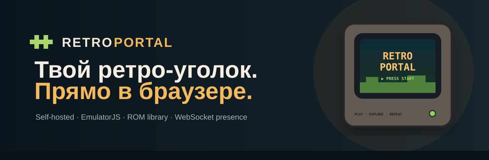

# Retro Portal

<p align="center"><strong>A cozy self-hosted retro game library that runs directly in the browser.</strong><br>Real artwork for your own games · EmulatorJS · server-hosted ROMs · local ROM player · WebSocket presence · Docker · safe Nginx integration</p>

<p align="center"><a href="README.md">Русский README</a> · <a href="docs/en/INSTALL.md">Install</a> · <a href="docs/en/NGINX.md">Nginx / TLS</a> · <a href="docs/en/ROMS.md">Games & artwork</a> · <a href="docs/en/DREAMCAST.md">Dreamcast</a></p>




### Local ROM player


Retro Portal turns an Ubuntu VPS or home server into a personal browser-based retro library. ROM files, artwork and EmulatorJS are hosted by you while emulation runs on the visitor's device through WebAssembly. No server-side GPU is required.

## Highlights

- warm CRT-inspired UI with subtle 8-bit details;
- real box-art covers and optional gameplay screenshot-on-hover;
- shelves by platform, search and a multiplayer filter;
- one-click launch for server-hosted ROMs;
- local ROM player that never uploads the selected ROM to the server;
- self-hosted EmulatorJS `4.2.3`;
- WebSocket online/playing presence;
- Docker Compose;
- interactive installer for fresh servers and existing Nginx deployments;
- safe handling of `stream :443 + ssl_preread`, PROXY protocol and internal TLS vhosts;
- existing wildcard/SAN certificate discovery, HTTP-01 and Cloudflare DNS-01;
- curated metadata presets for popular Mega Drive, PlayStation and experimental Dreamcast titles without shipping commercial game content.

## Requirements

| Resource | Minimum | Recommended |
|---|---:|---:|
| Ubuntu | 22.04 / 24.04 | 24.04 LTS |
| CPU | 1 vCPU | 2 vCPU |
| RAM | 1 GB | 2 GB |
| Disk | 15–20 GB | 40+ GB NVMe |
| Network | 100 Mbps | 1 Gbps |
| GPU | not required | not required |

## Quick start

```bash
sudo apt update
sudo apt install -y git
git clone https://github.com/indie-master/retro-portal.git retro-portal
cd retro-portal
sudo ./scripts/install.sh
```

For a quick demo:

```bash
./scripts/install-emulatorjs.sh 4.2.3
./scripts/install-homebrew-roms.sh
docker compose up -d --build
```

## Curated classics

Commercial ROMs, BIOS files and official artwork are not included. `catalog/presets/curated-classics.json` contains metadata and expected file names only. Put your own legally obtained files in the expected paths and run:

```bash
./scripts/sync-classics.sh
```

Only titles with an actual ROM, cover and required BIOS are imported, so the UI never associates a game with unrelated artwork.

Preset metadata currently covers Sonic the Hedgehog 2, Mortal Kombat II, Streets of Rage 2, Comix Zone, Road Rash 3, Contra: Hard Corps, Tekken 3, Crash Bandicoot 3, Crash Team Racing, Tony Hawk's Pro Skater 2, Resident Evil 2, Worms Armageddon and four experimental Dreamcast titles.

See [docs/en/ROMS.md](docs/en/ROMS.md).

## Dreamcast

Dreamcast is not part of EmulatorJS's standard supported-system list. The 2026 `flycast-wasm` project provides a browser-capable Flycast core, but it is much newer than the normal Mega Drive/PS1 path. Retro Portal already supports Dreamcast catalog metadata and multi-file BIOS checks, while the actual runtime remains intentionally experimental and disabled by default.

See [docs/en/DREAMCAST.md](docs/en/DREAMCAST.md).

## Legal

Retro Portal is software only. The repository does not distribute commercial ROMs, BIOS files or official game artwork. You are responsible for the content you add.

## License

Retro Portal code is MIT licensed. Third-party components retain their own licenses; see [THIRD_PARTY.md](THIRD_PARTY.md).
